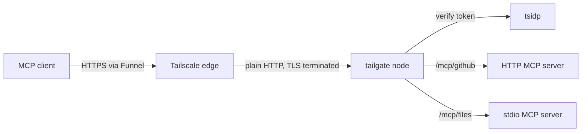

# tailgate

tailgate fronts [Model Context Protocol](https://modelcontextprotocol.io) servers behind Tailscale. It embeds a Tailscale node, exposes itself over [Funnel](https://tailscale.com/kb/1223/funnel), authenticates every request against a [tsidp](https://tailscale.com/docs/features/tsidp) OIDC token, and forwards only authorized calls to the MCP servers behind it.

The name is the point. tailgate stops identities from tailgating their way into sensitive MCP servers you have deliberately exposed to the internet.

## Status

Early and pre-release. tailgate depends on tsidp, which Tailscale ships as experimental and pre-1.0, so its token claims and app-capability schema may still change.

## How it works



A request travels through tailgate in four stages:

1. **Funnel edge.** tailgate embeds Tailscale with `tsnet` and serves Funnel on a supported port (443, 8443, or 10000). Tailscale terminates TLS and forwards plain HTTP to the node.
2. **Resource server.** tailgate answers as an MCP OAuth Resource Server. An unauthenticated request gets a `401` with a `WWW-Authenticate` header that points at the protected-resource metadata, which sends the client to tsidp.
3. **Validation and authorization.** tailgate validates the bearer token against tsidp, checks that the token's audience names the requested upstream, then authorizes the identity against the configured policy.
4. **Upstream.** An authorized request routes by path prefix to the named upstream, over HTTP or stdio.

## Routing and audiences

Each upstream is its own OAuth protected resource, addressed at `/mcp/<name>`:

```
https://tailgate.<tailnet>.ts.net/mcp/github
https://tailgate.<tailnet>.ts.net/mcp/files
```

Because Funnel strips tailnet identity, the token is the only identity signal tailgate has. A token minted for one upstream cannot be replayed against another, because its audience names a single upstream's canonical URI.

## Configuration

tailgate reads a [HuJSON](https://github.com/tailscale/hujson) file, the same format Tailscale ACL policies use:

```jsonc
{
  "node": {
    "hostname": "tailgate",
    "state_dir": "/var/lib/tailgate",
    "port": 443,
  },
  "oidc": {
    "issuer": "https://idp.<tailnet>.ts.net",
  },
  "upstreams": [
    { "name": "github", "transport": "http", "url": "http://127.0.0.1:9000/mcp" },
  ],
  "policy": [
    { "upstream": "github", "allow": [ { "email": "you@<tailnet>.ts.net" } ] },
  ],
}
```

An HTTP upstream needs a `url`. A stdio upstream needs a `command` and takes optional `args`, `env`, `dir`, `max_children`, and `idle_timeout`.

## Deployment

tailgate runs as a single binary under launchd:

```
tailgate -config /etc/tailgate.hujson
```

It needs:

- **A Tailscale auth key** in `TS_AUTHKEY` to join the tailnet on first start. Without one, tailgate logs an interactive login URL and waits.
- **The `funnel` node attribute** granted to tailgate's node in the tailnet policy. Without it, Funnel fails at the public edge.
- **A tsidp app-capability grant** that authorizes each upstream's resource URI and populates any claims the policy matches on.

`SIGINT` and `SIGTERM` stop the listener, drain in-flight requests and open streams for up to 30 seconds, close whatever connections remain, then leave the tailnet.

## Development

```
make build   # compile
make test    # go test -race
make vet     # go vet
make ci      # vet, build, test, staticcheck, govulncheck
```
