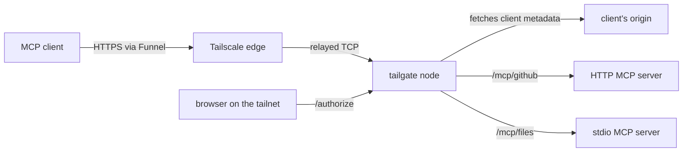

# tailgate

tailgate fronts [Model Context Protocol](https://modelcontextprotocol.io) servers behind Tailscale. It embeds a Tailscale node with [tsnet](https://tailscale.com/kb/1244/tsnet), exposes itself over [Funnel](https://tailscale.com/kb/1223/funnel), issues the OAuth tokens its clients present, and forwards only authorized calls to the MCP servers behind it. It stops identities tailgating their way into servers you exposed to the internet on purpose.

## Status

tailgate works end to end and fronts the author's own MCP servers for Claude and other clients. It is pre-1.0 because the [Client ID Metadata Document](https://datatracker.ietf.org/doc/draft-ietf-oauth-client-id-metadata-document/) draft and MCP's authorization specification are still moving, and a change there can require a change here.

## How It Works



The Funnel edge relays encrypted TCP and TLS terminates inside tailgate, on a listener whose certificate `tsnet` obtains for the node. tailgate answers an unauthenticated request with a `401` naming the metadata and scopes the client needs, and it is the authorization server that metadata points at. A client identifies itself with a Client ID Metadata Document, so nothing is registered and no secret exists anywhere. The person approving the client does so on a consent page reached from a device on the tailnet, where the connection itself says who they are. The tokens tailgate issues live in its memory. On every request it looks the bearer token up, checks that the token's audience names the requested upstream, and applies the configured policy. It logs every allow and deny, and strips the client's token before forwarding.

tailgate speaks every MCP revision from [2024-11-05](https://modelcontextprotocol.io/specification/2024-11-05) through [2026-07-28](https://modelcontextprotocol.io/specification/2026-07-28), resolving each request's revision from its `MCP-Protocol-Version` header, because it controls neither the clients it serves nor the servers it fronts.

## Installing

```sh
go install github.com/bendrucker/tailgate@latest
```

[`docs/deploying.md`](docs/deploying.md) covers everything between that and a serving node. [`docs/architecture.md`](docs/architecture.md) maps the internals. [`docs/security.md`](docs/security.md) states the trust boundaries and known limitations.

## Configuration

tailgate reads a [HuJSON](https://github.com/tailscale/hujson) file, the same format Tailscale ACL policies use. The loader rejects unknown fields, so a typo fails at startup instead of silently dropping config.

```jsonc
{
  "node": {
    "hostname": "tailgate",
    "tailnet": "example.ts.net",
    "state_dir": "/var/lib/tailgate",
    "port": 443,

    // Optional. Tagging moves the node's identity into policy and turns off
    // key expiry along with it. See Deployment.
    // "tags": ["tag:tailgate"],
  },
  "upstreams": [
    { "name": "github", "transport": "http", "url": "http://127.0.0.1:9000/mcp" },
    {
      "name": "files",
      "transport": "stdio",
      "command": "npx",
      "args": ["-y", "@modelcontextprotocol/server-filesystem", "/srv/shared"],
      "max_children": 4,
      "idle_timeout": "5m",
    },
  ],
  "policy": [
    { "upstream": "github", "allow": [ { "email": "you@example.com" } ] },
    { "upstream": "files", "allow": [ { "sub": "12345" } ] },
  ],
}
```

`node.port` must be a port Funnel supports: 443, 8443, or 10000. An upstream's `name` is both its path segment and its OAuth audience, so a token minted for `/mcp/github` cannot be replayed against `/mcp/files`. The struct in [`internal/config/config.go`](internal/config/config.go) is the schema for everything else.

## Development

```sh
make build        # compile
make test         # go test -race
make fmt          # gofmt -w
make vet          # go vet
make staticcheck  # staticcheck
make vuln         # govulncheck
make ci           # all of the above except fmt
```
