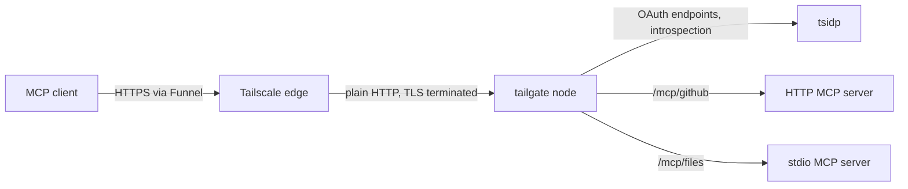
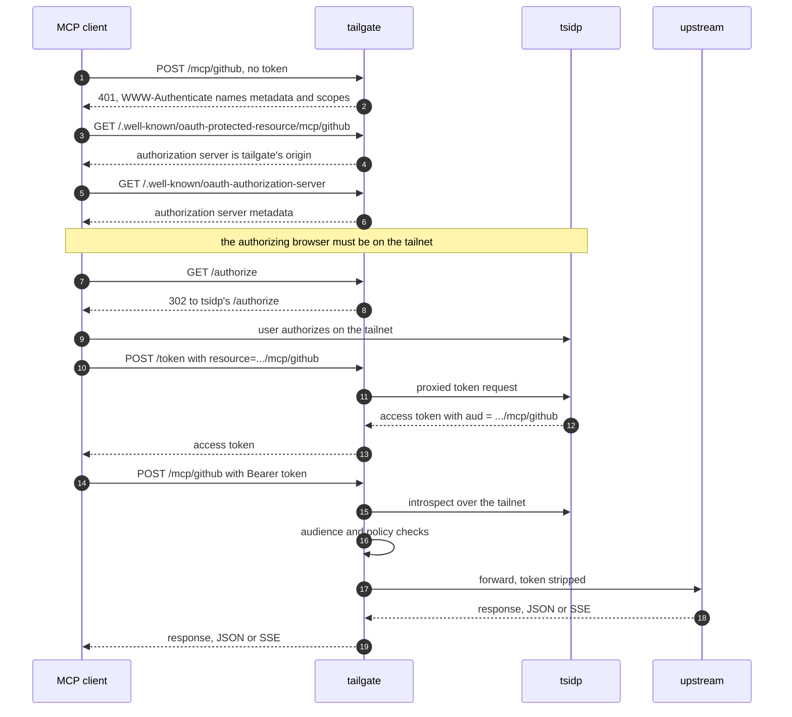

# tailgate

tailgate fronts [Model Context Protocol](https://modelcontextprotocol.io) servers behind Tailscale. It embeds a Tailscale node with [tsnet](https://tailscale.com/kb/1244/tsnet), exposes itself over [Funnel](https://tailscale.com/kb/1223/funnel), authenticates every request against a [tsidp](https://tailscale.com/docs/features/tsidp) OIDC token, and forwards only authorized calls to the MCP servers behind it.

The name is the point. tailgate stops identities from tailgating their way into sensitive MCP servers you have deliberately exposed to the internet.

## Status

tailgate works end to end and fronts the author's own MCP servers for Claude and other clients. It is pre-1.0 because tsidp, which Tailscale ships as experimental, may still change its token claims and app-capability schema, and those changes can require lockstep changes here.

## How It Works



A request travels through tailgate in four stages:

1. **Funnel edge.** tailgate embeds Tailscale with `tsnet` and serves Funnel on a supported port (443, 8443, or 10000). Tailscale terminates TLS and forwards plain HTTP to the node.
2. **Resource server.** tailgate answers as an OAuth protected resource per [RFC 9728](https://www.rfc-editor.org/rfc/rfc9728). An unauthenticated request gets a `401` whose `WWW-Authenticate` header names the protected-resource metadata and the required scopes. tailgate also fronts the authorization server at its own origin, so clients that assume same-origin OAuth work too.
3. **Validation and authorization.** tailgate validates the bearer token against tsidp by [RFC 7662](https://www.rfc-editor.org/rfc/rfc7662) introspection over the tailnet, checks that the token's audience names the requested upstream, then authorizes the identity against the configured policy. Every allow and deny is logged.
4. **Upstream.** An authorized request routes by path prefix to the named upstream, over HTTP or stdio. The client's token is stripped before forwarding and never reaches an upstream.

[`docs/architecture.md`](docs/architecture.md) maps the internals: the request pipeline, the transport seam, the stdio child lifecycle, session binding, and protocol-revision handling.

## Getting a Token

tsidp's access tokens are opaque, its `/authorize` endpoint only answers on the tailnet, and some clients never read the RFC 9728 discovery document. tailgate reconciles all of that by fronting the authorization server itself: the protected-resource metadata names tailgate's own origin as the authorization server, `/authorize` redirects the browser to tsidp, and `/token` is proxied to tsidp over the tailnet.



Clients like claude.ai that skip discovery and probe `/.well-known/oauth-authorization-server` at the MCP origin directly land on the same facade at step 5. Dynamic client registration is deliberately not proxied: tsidp gates it on the caller's tailnet identity. Register clients tailnet-side instead.

## Protocol Revisions

tailgate speaks every MCP revision from [2024-11-05](https://modelcontextprotocol.io/specification/2024-11-05) through [2026-07-28](https://modelcontextprotocol.io/specification/2026-07-28), resolving each request's revision from its `MCP-Protocol-Version` header. It fronts servers and serves clients it does not control, so it can never cut over to a single revision.

The revisions split into two eras, and tailgate holds the intermediary obligations of both. Through 2025-11-25, servers mint `Mcp-Session-Id` on initialize, and tailgate binds each session to the identity that created it. From 2026-07-28, protocol sessions are gone and selected body fields are mirrored into HTTP headers. tailgate refuses any request whose header and body disagree rather than routing on one while the upstream executes the other. For a stdio upstream, tailgate settles the child's era with a `server/discover` probe and runs the legacy `initialize` handshake itself when the child predates the revision, so old servers keep working for new clients.

Every refusal tailgate originates is a JSON-RPC error, never bare text, because a `400` with an unrecognized body is what tells a probing client the server predates the stateless revision. A proxy that answers in bare text talks its callers into downgrading.

## Routing and Audiences

Each upstream is its own OAuth protected resource, addressed at `/mcp/<name>`:

```
https://tailgate.<tailnet>.ts.net/mcp/github
https://tailgate.<tailnet>.ts.net/mcp/files
```

Because Funnel strips tailnet identity, the token is the only identity signal tailgate has. Tokens carry an [RFC 8707](https://www.rfc-editor.org/rfc/rfc8707) resource audience, and a token minted for one upstream cannot be replayed against another, because its audience names a single upstream's canonical URI.

## Security

tailgate is an internet-facing authorization boundary and its request path fails closed: any verification, introspection, or policy error denies the request. The client's bearer token never reaches an upstream. Sessions bind to the identity that minted them, and a session presented by anyone else gets a `404` that does not confirm the session exists. [`docs/security.md`](docs/security.md) covers the trust boundaries, the full set of request-path defenses, and the known limitations.

## Configuration

tailgate reads a [HuJSON](https://github.com/tailscale/hujson) file, the same format Tailscale ACL policies use. The loader rejects unknown fields. A typo fails at startup instead of silently dropping config.

```jsonc
{
  "node": {
    "hostname": "tailgate",
    "tailnet": "example.ts.net",
    "state_dir": "/var/lib/tailgate",
    "port": 443,
  },
  "oidc": {
    "issuer": "https://idp.example.ts.net",
  },
  "upstreams": [
    { "name": "github", "transport": "http", "url": "http://127.0.0.1:9000/mcp" },
    {
      "name": "files",
      "transport": "stdio",
      "command": "npx",
      "args": ["-y", "@modelcontextprotocol/server-filesystem", "/srv/shared"],
      "max_children": 4,
      "idle_timeout": "5m",
    },
  ],
  "policy": [
    { "upstream": "github", "allow": [ { "email": "you@example.com" } ] },
    { "upstream": "files", "allow": [ { "sub": "12345" } ] },
  ],
}
```

### node

`hostname` and `port` are required, and `port` must be a Funnel-supported port: 443, 8443, or 10000. `state_dir` holds the persistent node key. `tailnet` is the [MagicDNS](https://tailscale.com/kb/1081/magicdns) suffix. It is optional, but setting it lets `tailgate grant` build resource URIs offline and makes startup verify that the joined FQDN matches, since a control server that silently renames the node would shift every resource URI away from the grant.

### oidc

`issuer` is tsidp's base URL. tailgate discovers the introspection endpoint from it and requires the discovered document to stay on the issuer's origin.

### upstreams

Every upstream needs a unique lowercase `name`, which becomes its path segment and its audience, and a `transport` of `http` or `stdio`. An HTTP upstream needs a `url`. A stdio upstream needs a `command` and takes optional `args`, `env`, `dir`, `max_children` (concurrent children per identity, default 4), and `idle_timeout` (a Go duration after which an idle child is reaped, default 5m).

### policy

Each rule names an `upstream` and a non-empty `allow` list. An entry can match on `email`, `sub` (tsidp's bare decimal user ID), or `claim`, a map of introspection claim names to required string values. Conditions within one entry must all hold. Entries, and multiple rules for the same upstream, are alternatives: the first match allows. An upstream with no rules denies everyone, and a condition that cannot be evaluated denies rather than being skipped.

### favicon

An optional top-level `favicon` names an icon image to serve at `/favicon.ico`, along with a root page linking it. Icon crawlers index it for the origin, which is where clients like claude.ai get a custom connector's icon. Without it, those crawlers fall back to the parent domain's icon, which for a `*.ts.net` node is Tailscale's logo.

## Deployment

tailgate runs as a single binary under launchd:

```sh
tailgate -config /etc/tailgate.hujson
```

It needs:

- **A Tailscale auth key** in `TS_AUTHKEY` to join the tailnet on first start. Without one, tailgate logs an interactive login URL and waits a bounded window before exiting, rather than sitting forever on a login nobody is there to complete. `-open-login` hands that URL to the default browser, which is the one-time bootstrap on a machine with a human at it, and gets a longer window to match. The node key persists in `state_dir`, so later starts, including launchd's, never log in again.

  Node keys expire on the tailnet's [key expiry](https://tailscale.com/kb/1028/key-expiry) schedule, six months by default. A long-lived deployment wants expiry disabled for the node, or an [auth key](https://tailscale.com/kb/1085/auth-keys) scoped to a tag, since an expired key takes tailgate off the internet until someone reauthorizes it by hand.
- **The `funnel` node attribute** granted to tailgate's node in the tailnet policy. Without it, Funnel fails at the public edge.
- **A tsidp app-capability grant** that authorizes each upstream's resource URI and populates any claims the policy matches on. Generate it with [`tailgate grant`](#the-tsidp-grant) rather than writing it by hand.
- **Registered MCP clients.** tsidp's dynamic registration and admin UI are tailnet-only, so register each client tailnet-side as a confidential client and instruct it to send `resource` on the token request. Clients must request the `email` scope: introspection omits `email` without it, and an email-allowlist policy then denies every request. The `401` challenge and the metadata documents both name the scope, so a client that reads either discovers this without being told.

`SIGINT` and `SIGTERM` stop the listener, drain in-flight requests and open streams for up to 30 seconds, close whatever connections remain, then leave the tailnet. Setting `TAILGATE_TSNET_DEBUG` to any value surfaces tsnet's internal logs when a join or Funnel problem needs diagnosing.

## The tsidp Grant

tsidp matches an RFC 8707 `resource` parameter against its app-capability [grant](https://tailscale.com/kb/1324/acl-grants) byte-for-byte, with no canonicalization. The same resource string therefore has to appear identically in the client's token request, in tailgate's audience check, and in the tailnet policy. tailgate already owns the first two, so it generates the third:

```sh
tailgate grant -config /etc/tailgate.hujson
```

The output is one entry of the policy's `grants` array, ready to commit to whatever repository applies your tailnet policy. Regenerate it when upstreams change instead of editing the resource strings, since a hand-edited URI that no longer matches denies every request with an audience mismatch and nothing pointing at why.

Generating the grant needs `node.tailnet`, the MagicDNS suffix, because the canonical URIs are built from the node's FQDN and nothing else supplies it before the node joins. Setting it also makes tailgate check the name the join actually reports: if the control server hands back a suffixed hostname because the name was taken, every resource URI would shift away from the grant, so tailgate refuses to serve instead of denying every request at the audience check.

`-src`, `-dst`, and `-users` shape the grant envelope. `-dst` defaults to `*`, since tailgate cannot derive tsidp's node name from the issuer URL. Narrow it when tsidp is addressed by tag. `-allow-dcr` and `-allow-admin-ui` add the corresponding tsidp capabilities to the generated rule for tailnets that want dynamic registration or the admin UI enabled.

## Development

```sh
make build   # compile
make test    # go test -race
make vet     # go vet
make ci      # vet, build, test, staticcheck, govulncheck
```
