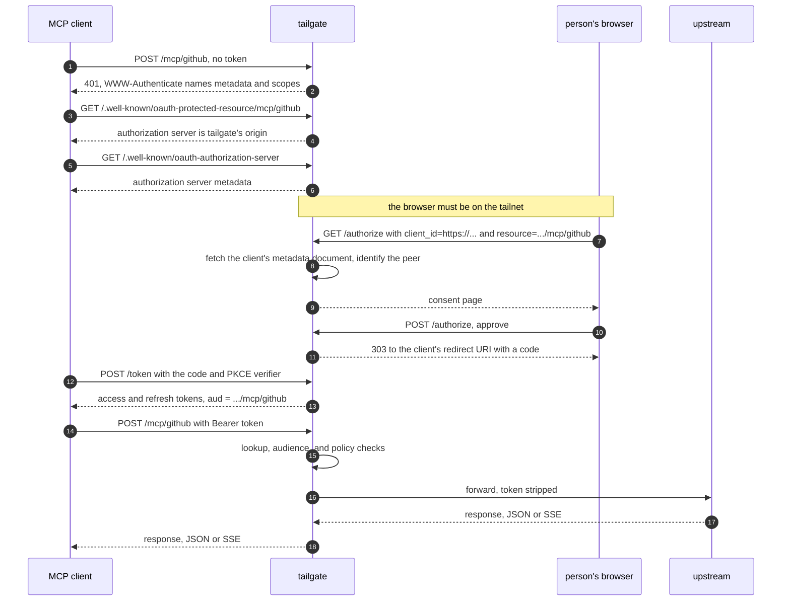

# Deploying tailgate

## Installing

```sh
go install github.com/bendrucker/tailgate@latest
```

## Tailnet Prerequisites

Grant the `funnel` node attribute to tailgate's node in the tailnet policy. Without it, Funnel fails at the public edge.

The node key is the longest-lived credential in the deployment. After the first join it replaces the auth key entirely, and anything that can read it is tailgate on your tailnet. How long it lasts follows from `node.tags`, which also states the node's identity in the config rather than leaving it implicit in whichever auth key minted the node.

Untagged, the key expires on the tailnet's [key expiry](https://tailscale.com/kb/1028/key-expiry) schedule, six months by default, and the deployment goes offline until someone reauthenticates it. [Applying a tag disables expiry by default](https://tailscale.com/docs/features/access-control/key-expiry), which keeps tailgate up and leaves the credential unbounded.

Prefer untagged with a scheduled rejoin. Tag the node when a rejoin is impractical, or when a shared tailnet needs the node's identity in policy more than it needs the bound. An untagged node with expiry disabled by hand is the one arrangement with neither property. The control server decides whether a node may adopt a tag it advertises, so grant the tag in your tailnet policy.

## Running as a Service

The config file and `state_dir` must be readable only by their owner, and tailgate refuses to start otherwise. The config holds every stdio upstream's credentials in `env`, and `state_dir` holds the node key and the TLS private key, so `chmod 600` on the config and `chmod 700` on the directory are part of installing it. `tsnet` creates `state_dir` at `0700` itself but leaves an existing directory at whatever mode it had.

Set `TS_AUTHKEY` for the first start so the node joins unattended. The node key persists in `state_dir`, so later starts never log in again. A launchd sketch:

```xml
<dict>
  <key>Label</key><string>com.bendrucker.tailgate</string>
  <key>ProgramArguments</key>
  <array>
    <string>/usr/local/bin/tailgate</string>
    <string>-config</string>
    <string>/etc/tailgate.hujson</string>
  </array>
  <key>EnvironmentVariables</key>
  <dict>
    <key>TS_AUTHKEY</key><string>tskey-auth-...</string>
  </dict>
  <key>RunAtLoad</key><true/>
  <key>KeepAlive</key><true/>
  <key>ExitTimeOut</key><integer>60</integer>
</dict>
```

The systemd equivalent:

```ini
[Service]
ExecStart=/usr/local/bin/tailgate -config /etc/tailgate.hujson
Environment=TS_AUTHKEY=tskey-auth-...
Restart=always
TimeoutStopSec=60
```

`SIGINT` and `SIGTERM` stop the listener, drain in-flight requests and open SSE streams for up to 30 seconds, then wait up to 10 more for connections that never reached a transport. The supervisor's kill timeout must exceed the 40-second total.

## Startup Failures

Nothing serves until every startup step succeeds, so a failure here is downtime rather than an unauthenticated window.

- A node with no auth key and no saved state exits after 90 seconds rather than waiting on a login nobody is there to complete. Run once with `-open-login` on a machine with a browser to authorize interactively, which waits five minutes.
- Setting `node.tailnet` makes tailgate compare the name the join reports against it. A mismatch stops it, because a control server that suffixes a taken hostname shifts every resource URI away from the URL every client was configured with.
- An optional top-level `favicon` names an image file, served at `/favicon.ico` under a root page linking it. A path that cannot be read, or that is zero bytes, fails startup. Without one, the icon crawlers that supply a client like claude.ai with a connector icon fall back to Tailscale's logo for a `*.ts.net` node.
- A config file from a release that used tsidp still carries an `oidc` section. Unknown keys refuse the whole file rather than being dropped, so delete that section before upgrading. The `tailgate grant` command is gone along with it, and the tsidp client and ACL grant it wrote are no longer read.

## Connecting Clients

Nothing is registered and there is no client secret. A client identifies itself with a [Client ID Metadata Document](https://datatracker.ietf.org/doc/draft-ietf-oauth-client-id-metadata-document/), which claude.ai and FastMCP do. Give the client the upstream's URL, `https://<node>.<tailnet>.ts.net/mcp/<name>`, and it discovers the authorization server from the `401`. A client that asks for an authorization server URL outright takes tailgate's own origin.

When the client sends you to authorize, open the link on a device that is on the tailnet. The consent page identifies you by the connection, and a browser arriving over the public internet is told to move. The page names the client, the host publishing its metadata document, the host the authorization code will be sent to, and the upstream. Approving issues a token for that one upstream, and the client refreshes it on its own for thirty days.

Policy is allow-only, so an upstream with no rule is reachable by nobody. A `sub` match is your bare decimal Tailscale user ID, and an `email` match is your tailnet login name. A `claim` map matches the rest of what a token carries: `name`, `scope`, `client_id`, and `aud`.

## Getting a Token



A client that skips discovery joins at step 5, probing `/.well-known/oauth-authorization-server` at the MCP origin.

## Node Key Rotation

There is no rotate command. Rotation is a rejoin, and the order matters.

1. Delete the node in the tailnet admin console.
2. Delete `state_dir`.
3. Start tailgate with a fresh `TS_AUTHKEY`, or once with `-open-login`.

Deleting the node first frees the hostname. A name still held comes back from the control server with a suffix appended, and every canonical resource URI is built from the name the join reports, so a rejoin landing on `tailgate-1` shifts every audience away from the URL every client was configured with. With `node.tailnet` set, tailgate catches that and refuses to serve rather than denying every request at the audience check. It cannot name the stale node behind the mismatch, so check the admin console.

## Limits

Request bodies are capped at 1 MiB and session bindings expire after an hour. Neither has a config key. On a stdio upstream, `max_children` (default 4) and `idle_timeout` (default 5m) are the only tunable limits.

## Operating Notes

The Funnel listener also accepts tailnet peers dialing the same port, which is how the consent page knows who is approving. An MCP request still needs a bearer token whichever way it arrives, since tailnet identity is used only to authorize a client, never in place of a token.

Setting `TAILGATE_TSNET_DEBUG` to any non-empty value routes the embedded node's internal logs to `slog`. Funnel ingress problems show up there.

[architecture.md](architecture.md) maps the internals. [security.md](security.md) states the trust boundaries and the known limitations, including how long revocation lags.
