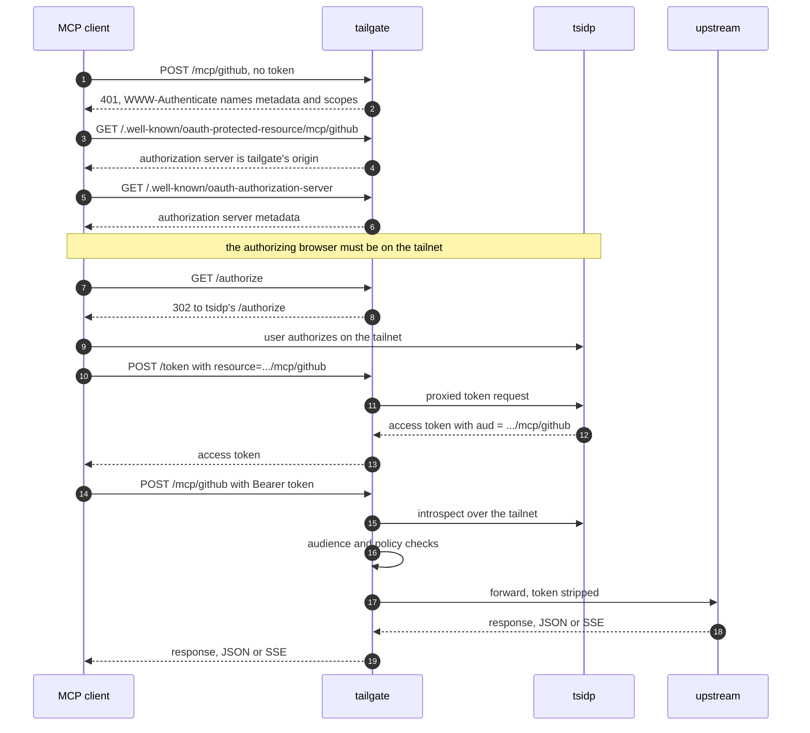

# Deploying tailgate

## Installing

```sh
go install github.com/bendrucker/tailgate@latest
```

## Tailnet Prerequisites

tsidp must already be running on the tailnet. [Tailscale's tsidp documentation](https://tailscale.com/docs/features/tsidp) covers deploying it, and its URL is the `oidc.issuer` value.

Grant the `funnel` node attribute to tailgate's node in the tailnet policy. Without it, Funnel fails at the public edge.

Node keys expire on the tailnet's [key expiry](https://tailscale.com/kb/1028/key-expiry) schedule, six months by default. Disable expiry for tailgate's node, or use an [auth key](https://tailscale.com/kb/1085/auth-keys) scoped to a tag. An expired key takes tailgate offline until someone reauthorizes it by hand.

## The tsidp Grant

tsidp matches the RFC 8707 `resource` parameter against its app-capability [grant](https://tailscale.com/kb/1324/acl-grants) with no canonicalization, so the same string has to appear identically in the client's token request, in tailgate's audience check, and in the tailnet policy. tailgate owns the first two and generates the third:

```sh
tailgate grant -config /etc/tailgate.hujson >> tailnet-policy/grants.hujson
```

The output is one entry of the policy's `grants` array. Regenerate it when upstreams change rather than editing a resource string, since a hand-edited URI denies every request with an audience mismatch and nothing pointing at why.

Generating never contacts the control server, which is why it needs `node.tailnet` in the config: the resource URIs are built from the node's FQDN. `-src`, `-dst`, and `-users` shape the grant envelope. `-dst` defaults to `*` because a grant destination must be a tag, user, group, host alias, or address, none of which can be derived from the issuer URL. Narrow it when tsidp runs on a tagged node. `-allow-admin-ui` and `-allow-dcr` add those tsidp capabilities to the generated rule, and neither is granted by default.

## Running as a Service

Set `TS_AUTHKEY` for the first start so the node joins unattended. The node key persists in `state_dir`, so later starts never log in again. A launchd sketch:

```xml
<dict>
  <key>Label</key><string>com.bendrucker.tailgate</string>
  <key>ProgramArguments</key>
  <array>
    <string>/usr/local/bin/tailgate</string>
    <string>-config</string>
    <string>/etc/tailgate.hujson</string>
  </array>
  <key>EnvironmentVariables</key>
  <dict>
    <key>TS_AUTHKEY</key><string>tskey-auth-...</string>
  </dict>
  <key>RunAtLoad</key><true/>
  <key>KeepAlive</key><true/>
  <key>ExitTimeOut</key><integer>60</integer>
</dict>
```

The systemd equivalent:

```ini
[Service]
ExecStart=/usr/local/bin/tailgate -config /etc/tailgate.hujson
Environment=TS_AUTHKEY=tskey-auth-...
Restart=always
TimeoutStopSec=60
```

`SIGINT` and `SIGTERM` stop the listener, drain in-flight requests and open SSE streams for up to 30 seconds, then wait up to 10 more for connections that never reached a transport. The supervisor's kill timeout must exceed the 40-second total.

## Startup Failures

Nothing serves until every startup step succeeds, so a failure here is downtime rather than an unauthenticated window.

- A node with no auth key and no saved state exits after 90 seconds rather than waiting on a login nobody is there to complete. Run once with `-open-login` on a machine with a browser to authorize interactively, which waits five minutes.
- The issuer's discovery document must carry an `issuer` field equal to the configured `oidc.issuer`, and must advertise an `introspection_endpoint` sharing the issuer's scheme and host.
- Setting `node.tailnet` makes tailgate compare the name the join reports against it. A mismatch stops it, because a control server that suffixes a taken hostname shifts every resource URI away from the grant.
- An optional top-level `favicon` names an image file, served at `/favicon.ico` under a root page linking it. A path that cannot be read, or that is zero bytes, fails startup. Without one, the icon crawlers that supply a client like claude.ai with a connector icon fall back to Tailscale's logo for a `*.ts.net` node.

## Registering Clients

tsidp's `/register` and admin UI answer only on the tailnet, and tailgate does not front `/register`. Register each MCP client as a confidential client from a tailnet device, in tsidp's admin UI at the issuer origin.

Give the client its `client_id` and `client_secret`, plus the `resource` value for the upstream it calls, which is the canonical URI `tailgate grant` emitted for that upstream. A client that omits `resource` on the token request gets a token carrying no resource audience, and every one of its requests then fails the audience check.

Clients must request the `email` scope. Introspection omits `email` without it, and an email allowlist then denies every request from that client.

A client that discovers its authorization server from the RFC 9728 metadata needs no further configuration. One that asks for an authorization server URL outright, as claude.ai does, takes tailgate's own origin, `https://<node>.<tailnet>.ts.net`, which fronts `/authorize` and `/token`.

Policy is allow-only, so an upstream with no rule is reachable by nobody. A `sub` match is tsidp's bare decimal user ID, not the `userid:N` form that appears in ID tokens. A `claim` map matches the rest of what introspection returns, which is `username` and `scope`.

## Getting a Token

Whoever completes the `/authorize` step has to be on the tailnet, since tsidp refuses that endpoint over Funnel.



A client that skips discovery joins at step 5, probing `/.well-known/oauth-authorization-server` at the MCP origin.

## Limits

Request bodies are capped at 1 MiB and session bindings expire after an hour. Neither has a config key. On a stdio upstream, `max_children` (default 4) and `idle_timeout` (default 5m) are the only tunable limits.

## Operating Notes

The Funnel listener also accepts tailnet peers dialing the same port. Those requests still need a bearer token, because Funnel strips tailnet identity.

Setting `TAILGATE_TSNET_DEBUG` to any non-empty value routes the embedded node's internal logs to `slog`. Funnel ingress problems show up there.

[architecture.md](architecture.md) maps the internals. [security.md](security.md) states the trust boundaries and the known limitations, including how long revocation lags.
